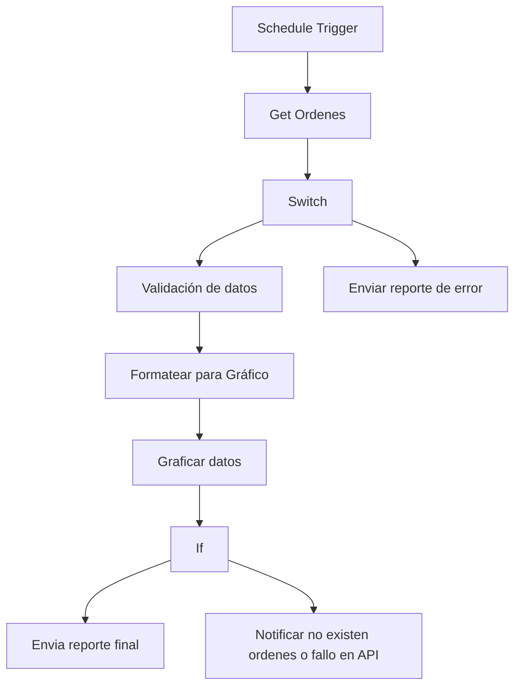
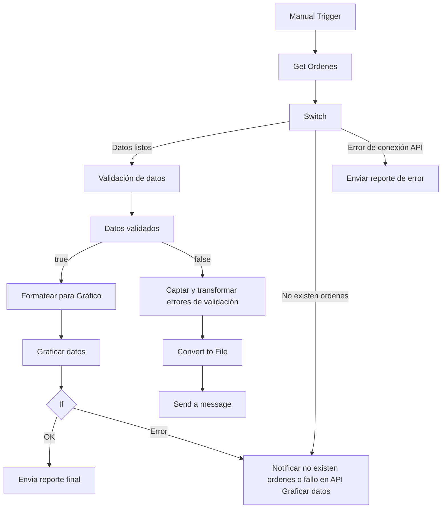

# API Data Analytics & Reporting Pipeline

Workflow de **n8n** que implementa un pipeline completo para la **validación, análisis y reporte de órdenes** provenientes de una API. Incluye validaciones de datos, generación de métricas, visualización gráfica y notificaciones automatizadas por correo electrónico.

---

##  Funcionalidades principales

- **Ingesta de datos**: Obtiene órdenes desde un endpoint configurable (`{{API_ENDPOINT_ORDERS}}`).
- **Validación robusta**: Verifica campos críticos (ID, nombre de cliente, teléfono, items de la orden).
- **Procesamiento de métricas**:
  - Órdenes pendientes, procesadas, completadas y canceladas.
  - Monto total de ventas (formateado en USD).
  - Producto más vendido.
- **Visualización automática**: Genera un gráfico tipo *doughnut* con [QuickChart](https://quickchart.io).
- **Notificaciones inteligentes**:
  - Reporte diario de ventas con métricas y gráfico.
  - Alertas de error de conexión con la API.
  - Aviso cuando la API responde sin datos.

---

##  Arquitectura del Workflow

Este pipeline está diseñado bajo principios de **modularidad y mantenibilidad**:

- **Trigger programado**: ejecuta automáticamente el flujo en intervalos definidos.
- **Ingesta de datos**: obtiene órdenes desde la API (`{{API_ENDPOINT_ORDERS}}`).
- **Validación de datos**: asegura integridad y consistencia de la información.
- **Procesamiento de métricas**: genera KPIs clave para el negocio.
- **Visualización**: produce gráficos dinámicos con QuickChart.
- **Notificaciones**: envía reportes y alertas vía Gmail (`{{CREDENCIAL_GMAIL}}`).

---
##  Métricas y Analítica

El sistema computa y normaliza los siguientes indicadores clave:

1. **Estado de Operaciones:** Desglose transaccional por estatus.
2. **Desempeño Financiero:** Cálculo del ingreso total formateado.
3. **Análisis de Inventario:** Determinación del producto líder en ventas.
4. **Alcance de Usuario:** Conteo de clientes únicos procesados en el ciclo.

Estas métricas permiten un **seguimiento diario del rendimiento comercial**.

---

##  Requisitos previos

- Instancia de **n8n** (v1.121.3 o superior recomendado).
- Credenciales de Gmail configuradas en n8n:
  - Placeholder: `{{CREDENCIAL_GMAIL}}`
- Endpoint de API accesible:
  - Placeholder: `{{API_ENDPOINT_ORDERS}}`
- Dirección de correo destino:
  - Placeholder: `{{EMAIL_DESTINO}}`

---

##  Configuración de placeholders

Antes de ejecutar el workflow, reemplaza los siguientes valores:

| Placeholder            | Descripción                                   | Ejemplo                          |
|------------------------|-----------------------------------------------|----------------------------------|
| `{{API_ENDPOINT_ORDERS}}` | URL de la API de órdenes                     | `http://mi-servidor:8484/orders` |
| `{{EMAIL_DESTINO}}`       | Correo electrónico para recibir reportes     | `equipo@empresa.com`             |
| `{{CREDENCIAL_GMAIL}}`    | Nombre de la credencial Gmail en n8n         | `Cuenta Gmail Corporativa`       |

---

##  Flujo de la automatización



##  Funcionalidades Principales

- **Ingesta de Datos (ETL):** Extracción automatizada de órdenes desde un endpoint configurable (`{{API_ENDPOINT_ORDERS}}`).
- **Esquema de Validación Robusto:** Garantiza la integridad de la información mediante la verificación de campos críticos (IDs, metadatos de cliente y estructuras de ítems).
- **Procesamiento de KPIs:**
  - Segmentación por estados: Pendientes, Procesadas, Completadas y Canceladas.
  - Consolidación del Volumen Bruto de Ventas (GMV) en USD.
  - Identificación de productos con mayor rotación (Top Selling Products).
- **Visualización de Datos:** Generación dinámica de gráficos de tipo *doughnut* mediante la integración con [QuickChart](https://quickchart.io).
- **Sistema de Notificaciones Inteligentes:**
  - Envío de informes ejecutivos diarios.
  - Protocolos de alerta ante errores de conectividad o respuestas nulas de la API.

---
```
##  Configuración de Parámetros (Placeholders)

| Parámetro | Definición Técnica | Ejemplo de Referencia |
| :--- | :--- | :--- |
| `{{API_ENDPOINT_ORDERS}}` | URL base del servicio de datos | `https://api.empresa.com/v1/orders` |
| `{{EMAIL_DESTINO}}` | Destinatario final del reporte ejecutivo | `analytics@empresa.com` |
| `{{CREDENCIAL_GMAIL}}` | Identificador de credencial encriptada en n8n | `Gmail_Auth_Production` |

---

##  Instalación y despliegue 

1. **Importar el workflow** en tu instancia de n8n.
2. **Configurar credenciales** de Gmail en la sección *Credentials*.
3. **Definir variables de entorno** para: - `{{API_ENDPOINT_ORDERS}}` - `{{EMAIL_DESTINO}}` - `{{CREDENCIAL_GMAIL}}`.
4. **Activar el workflow** y verificar la ejecución programada.
---
 ##  Escalabilidad y mantenimiento 
 
 - **Escalable**: puede adaptarse a múltiples endpoints o bases de datos.
 - **Mantenible**: el código de validación está modularizado para facilitar ajustes.
 - **Internacionalizable**: soporta formateo de moneda y mensajes en distintos idiomas.
 - **Seguro**: credenciales y datos sensibles se gestionan mediante placeholders y variables de entorno.
---

##  Pruebas recomendadas 

- **Prueba de conexión API**: validar que el endpoint responde con datos.
- **Prueba de error controlado**: simular desconexión para verificar alertas. 
- **Prueba de datos vacíos**: confirmar que se envía la notificación preventiva.
- **Prueba de métricas**: revisar que los cálculos coincidan con la base de datos.
---

##  Ejemplo de reporte diario El correo incluye: 

- Tabla con métricas clave.
- Gráfico tipo *doughnut* con estados de órdenes.
- Monto total de ventas formateado.
- Mensaje corporativo con branding y estilo profesional.
---

##  Cumplimiento y seguridad 

- **Protección de datos**: no se exportan credenciales reales en el JSON.
- **Buenas prácticas**: uso de variables de entorno y placeholders.
- **Auditoría**: logs de ejecución disponibles en n8n para trazabilidad.
- **Cumplimiento corporativo**: alineado con políticas de seguridad y privacidad de datos empresariales.
---

##  Roadmap empresarial 

- Integración con sistemas ERP/CRM para sincronización de órdenes.
- Extensión a múltiples canales de notificación (Slack, Teams, SMS).
- Dashboards en tiempo real con herramientas BI.
- Internacionalización completa de reportes.
---
